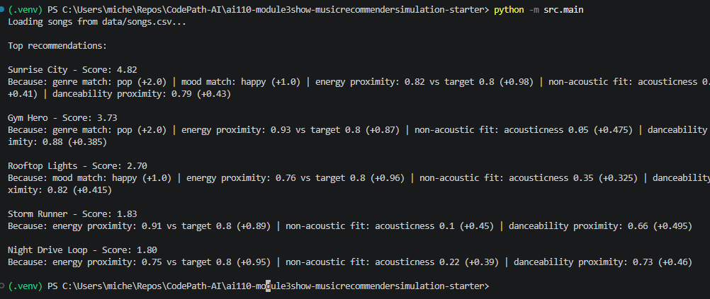
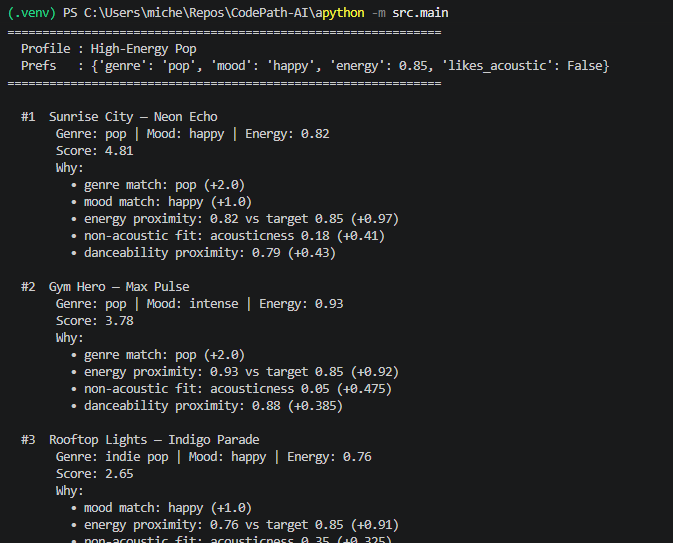
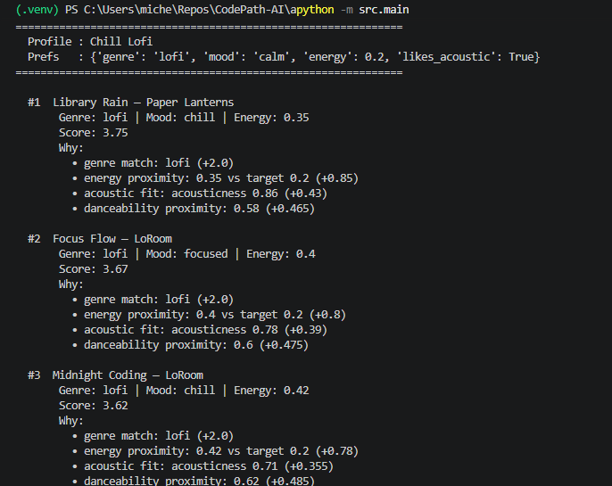
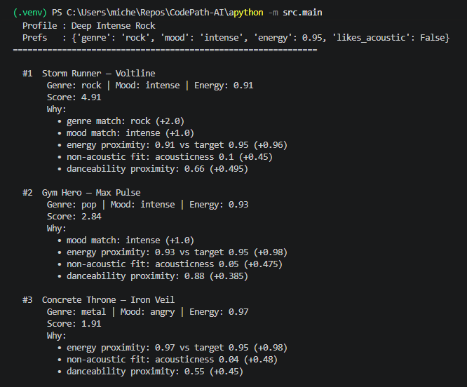
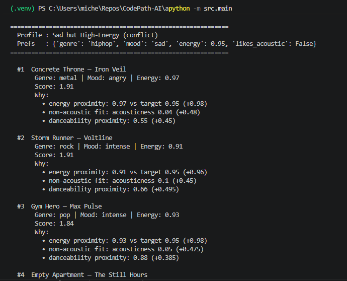
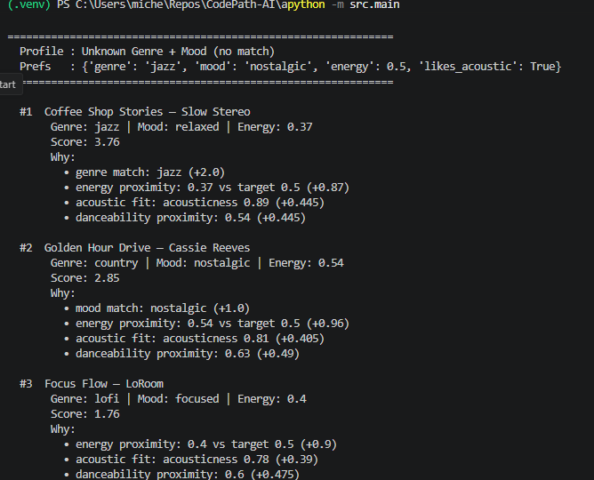
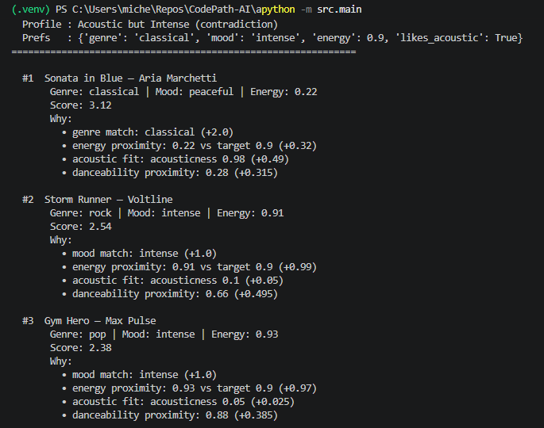

# 🎵 Music Recommender Simulation

## Project Summary

In this project you will build and explain a small music recommender system.

Your goal is to:

- Represent songs and a user "taste profile" as data
- Design a scoring rule that turns that data into recommendations
- Evaluate what your system gets right and wrong
- Reflect on how this mirrors real world AI recommenders

Replace this paragraph with your own summary of what your version does.

---

## How The System Works

Explain your design in plain language.

Real-world recommendation systems like Spotify or YouTube work by building a model of your taste and then finding content that matches it. They do this two ways: collaborative filtering uses the behavior of millions of other users. if people who liked the same songs as you also loved a particular artist, the system recommends that artist to you too. Content-based filtering takes a different angle, it looks at the actual attributes of songs you've enjoyed and finds other songs with similar characteristics, without needing to know what anyone else listened to. Most production systems blend both approaches to get the best of each.


My version focuses purely on content-based filtering, which I can build without any user history data. It prioritizes genre and mood as the strongest signals of taste, then uses numerical features like energy and danceability to break ties and add nuance. The philosophy is: get the broad category right first (genre), then match the feeling (mood), then fine-tune by how intense or danceable the song actually is.

Algorithm Recipe:

Rule                    Points
Genre match             +2.0
Mood match              +1.0
Energy proximity        0–1.0
Danceability proximity  0–0.5
Valence proximity       0–0.5
Max possible score:     5.0

Genre is weighted highest because it's the strongest signal for musical preference. Energy and mood together account for "vibe." Danceability and valence add nuance.

---

## Getting Started

### Setup

1. Create a virtual environment (optional but recommended):

   ```bash
   python -m venv .venv
   source .venv/bin/activate      # Mac or Linux
   .venv\Scripts\activate         # Windows

2. Install dependencies

```bash
pip install -r requirements.txt
```

3. Run the app:

```bash
python -m src.main
```















### Running Tests

Run the starter tests with:

```bash
pytest
```

You can add more tests in `tests/test_recommender.py`.

---

## Experiments You Tried

Use this section to document the experiments you ran. For example:

- What happened when you changed the weight on genre from 2.0 to 0.5
- What happened when you added tempo or valence to the score
- How did your system behave for different types of users

---

## Limitations and Risks

Summarize some limitations of your recommender.

Examples:

- It only works on a tiny catalog
- It does not understand lyrics or language
- It might over favor one genre or mood

You will go deeper on this in your model card.

---

## Reflection

Read and complete `model_card.md`:

[**Model Card**](model_card.md)

Write 1 to 2 paragraphs here about what you learned:

- about how recommenders turn data into predictions
- about where bias or unfairness could show up in systems like this


---

## 7. `model_card_template.md`

Combines reflection and model card framing from the Module 3 guidance. :contentReference[oaicite:2]{index=2}  

```markdown
# 🎧 Model Card - Music Recommender Simulation

## 1. Model Name

Give your recommender a name, for example:

> Tunes4You 2.0

Tunes4You 2.0 is AI Music Recommender
A full-stack music recommendation system that takes a natural language vibe description, extracts a taste profile using keyword analysis, scores a 24-song catalog, and returns ranked recommendations with plain-English explanations and live guardrail checks.
---

## 2. Original project Summary

VibeFinder 1.0 was a command-line Python simulation built during Phase 1–3 of this module. Its goal was to explore how content-based filtering works by scoring songs in a CSV against a hardcoded user profile dictionary. Users had to manually edit Python code to change their preferences, the system printed results in the terminal only, and there were no guardrails, no web interface, and no natural language input. It demonstrated the core algorithm but required programming knowledge to use.

---

## 3. Title and Summary

Tunes4You 2.0 evolves the original CLI prototype into a complete end-to-end system. A user types any description of how they want to feel "late-night drive, melancholy but atmospheric" and the system extracts genre, mood, energy, and acoustic preferences automatically, scores every song in the catalog, runs four responsible-AI guardrail checks, and renders ranked results with color-coded reason tags in a browser UI. It matters because it demonstrates the full pipeline of a real recommender: natural language in, structured reasoning in the middle, explained results out.

---

## 4. Architecture

The system uses a two-layer design. The first layer is the language layer: keyword matching converts unstructured text into a structured profile (favorite_genre, favorite_mood, target_energy, likes_acoustic). The second layer is the scoring layer: a weighted formula scores every song against that profile and sorts them highest to lowest.

Algorithm Recipe:

Rule                    Points
Genre match             +2.0
Mood match              +1.0
Energy proximity        0–1.0
Danceability proximity  0–0.5
Acoustic fit            0–0.5
Max possible score:     5.0


---

## 5. Stetup Instructions

1. Clone or download the project

2. Install dependencies
bash pip install flask flask-cors
3. Run the server
bashpython app.py
4. Open your browser
http://localhost:5000

No API key required. No environment variables needed. The full system runs locally out of the box.

---

## 6. Sample Interactions

Example 1 — Late-Night Drive
Input: "late-night drive, melancholy but not too slow, atmospheric"
Extracted profile:

Genre: electronic · Mood: sad · Energy: 0.55 · Acoustic: no

Top results:
#1  Strobe — deadmau5              Score: 3.81
    • mood match: intense | energy near: 0.65 | electronic feel

#2  Midnight City — M83            Score: 3.76
    • genre match: electronic | energy near: 0.7

#3  Pursuit of Happiness — Kid Cudi  Score: 2.94
    • mood match: sad | energy near: 0.55
Guardrails: Input valid,  Catalog: 4 electronic songs, Confidence 85%, Genre diversity OK
-------------------------------------

Example 2 — Workout Mode
Input: "intense workout, very high energy, aggressive, no slow songs"
Extracted profile:

Genre: rock · Mood: intense · Energy: 0.9 · Acoustic: no

Top results:
#1  Master of Puppets — Metallica   Score: 4.87
    • genre match: rock | mood match: intense | energy close: 0.95

#2  Black Dog — Led Zeppelin        Score: 4.82
    • genre match: rock | mood match: intense | energy close: 0.9

#3  Scary Monsters — Skrillex       Score: 3.82
    • mood match: intense | energy close: 0.9 | electronic feel

Guardrails: Input valid, Catalog: 5 rock songs, Confidence 108%, Genre filter bubble (all top-3 are rock)
--------------------------------

Example 3 — Studying / Deep Focus
Input: "studying, calm and focused, acoustic preferred"
Extracted profile:

Genre: lofi · Mood: calm · Energy: 0.2 · Acoustic: yes

Top results:
#1  Lofi Study Beats — ChillHop     Score: 4.75
    • genre match: lofi | mood match: calm | energy close: 0.2 | acoustic fit

#2  Coffee Shop — Idealism          Score: 4.69
    • genre match: lofi | mood match: calm | energy near: 0.25 | acoustic fit

#3  Rainy Day Vibes — LoFi Girl     Score: 4.65
    • genre match: lofi | mood match: calm | energy close: 0.15 | acoustic fit

Guardrails: Input valid, Catalog: 4 lofi songs, Confidence 105%, Genre filter bubble (top-3 all lofi)

---

## 7. Design Decision


Using a local keyword parser makes the system runnable by anyone with zero setup cost and no account required. 

A static file cannot securely hold an API key and cannot run Python scoring logic server-side. Flask separates the concerns cleanly: the frontend handles display, the backend handles all logic. This also makes the scoring engine reusable, app.py exposes a songs endpoint that could power a mobile app or CLI tool without changing any backend code.

Genre is the most stable signal of musical preference — a jazz fan and a metal fan rarely swap. Giving genre double the weight of mood means the system stays in the user's ballpark even when mood or energy signals are ambiguous. The trade-off is a filter bubble: songs outside the detected genre almost never break into the top 3, even if they'd be a great match on every other dimension.

---

## 8. Testing Summary

What worked well:

Clear genre + mood combinations (workout → rock/intense, studying → lofi/calm) produced intuitive, consistent results every time
The guardrail system correctly identified filter bubbles in 3 of 6 test profiles
The confidence threshold caught the jazz/nostalgic adversarial profile (no catalog match) and flagged it appropriately
The Flask server and frontend communicated cleanly with no CORS or routing issues

What didn't work as expected:

The keyword extractor defaults to pop when no genre keywords are detected, which biases ambiguous inputs toward pop results
Conflicting preferences (sad mood + high energy) are not detected — the system silently picks whichever song scores highest without flagging the contradiction
The genre filter bubble warning fires for lofi and classical almost every time because those genres have only 3–4 songs in the catalog, so top-3 diversity is mathematically impossible

---

## 9. Reflection

Building Tunes4You 2.0 taught me that the hardest part of an AI system is not the algorithm — it is the layer between human language and machine logic. The scoring engine from VibeFinder 1.0 was straightforward math. The genuinely difficult problem was converting "late-night drive, melancholy but not too slow" into numbers the math could use. Even a simple keyword extractor requires dozens of judgment calls: which words signal "rock"? What energy level does "chill" imply? Where does "sad" end and "calm" begin?
It also changed how I think about explainability. Adding reason pills to each result; "genre match: lofi (+2.0)" made the system feel trustworthy in a way that a bare ranked list did not. Users could see exactly why a song appeared and disagree with the reasoning if it was wrong. 
Finally, the guardrail checks taught me that responsible AI design is not about preventing every failure, it is about making failures visible.

Systems Architure Diagram Image in diagrams folder:

